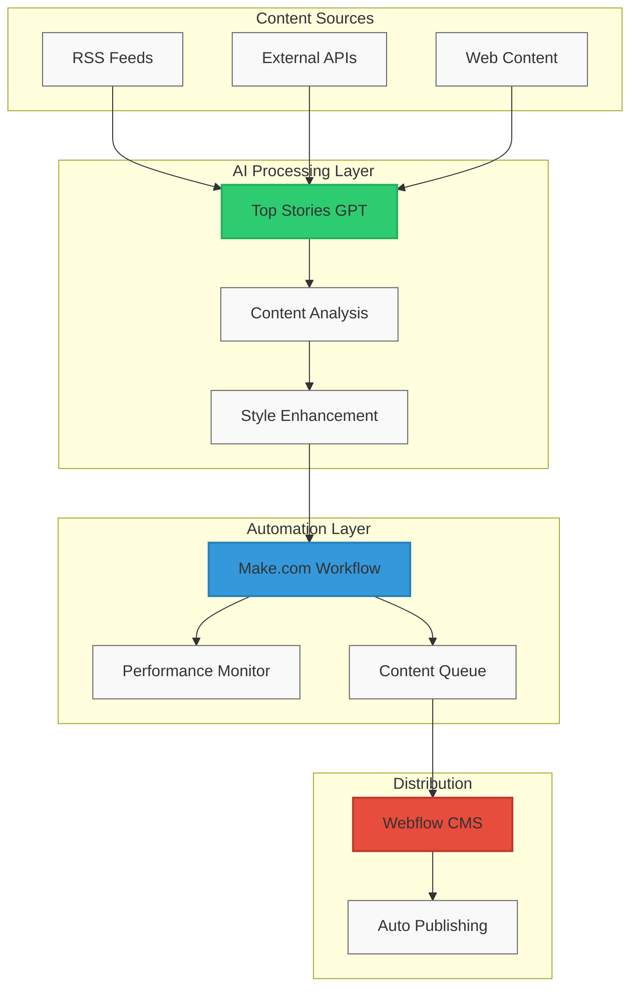

# Top Stories GPT

  

Your automated content ninja. Transform RSS feeds into polished, executive-style articles that drive decisions. Pick your topic, get fresh insights, and publish with authority – all in minutes, not hours.

## Overview

Top Stories GPT streamlines content creation by turning industry news into sharp, executive-ready articles. It combines GPT technology with automated workflows to deliver professional content that cuts through the noise.

## System Architecture

## Key Features

- **Fast & Fresh**: From RSS to polished article in minutes
- **Executive Edge**: Clear, authoritative business writing
- **Smart Automation**: RSS monitoring to publishing, hands-free
- **Quality Control**: Built-in tone and fact-checking
- **Instant Publishing**: Direct to your CMS, no manual work needed

## Documentation

- [GPT Instructions](docs/gpt-instructions.md): Configuration and content structure
- [Make Workflow](docs/make-workflow.md): Automation pipeline documentation
- [Performance Metrics](docs/performance-metrics.md): System monitoring and optimization
- [Terminology Guide](docs/terminology-guide.md): Professional language guidelines
- [Webflow Integration](docs/webflow-integration.md): CMS configuration and usage

## Example Content

The `/examples` directory contains sample articles demonstrating:
- Professional tone and structure
- Strategic content framing
- Executive-focused insights
- Executive-style formatting

## Getting Started

1. Review the documentation in `/docs`
2. Examine example articles in `/examples`
3. Configure webhook settings in `/src/make`
4. Set up Webflow integration using `/src/webflow`

## System Requirements

- Make.com account with webhook access
- Webflow CMS subscription
- GPT API access
- Node.js environment

## Contributing

1. Fork the repository
2. Create a feature branch
3. Submit a pull request

## License

Copyright 2025. All rights reserved.