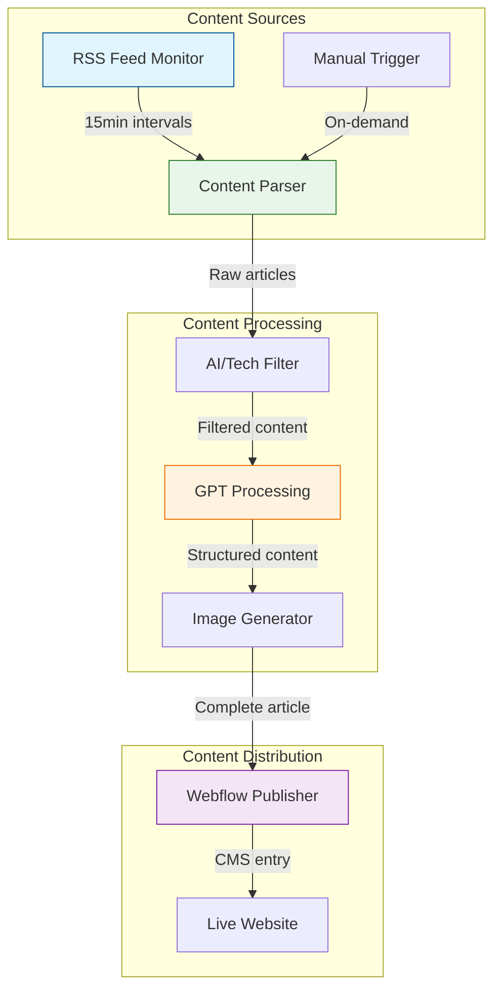
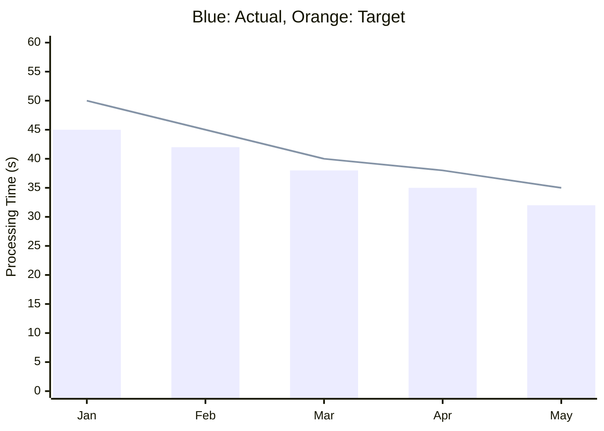
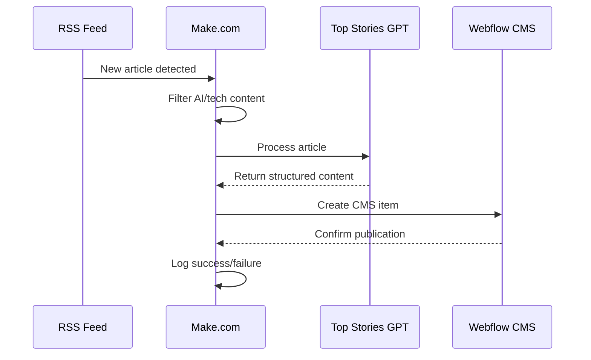
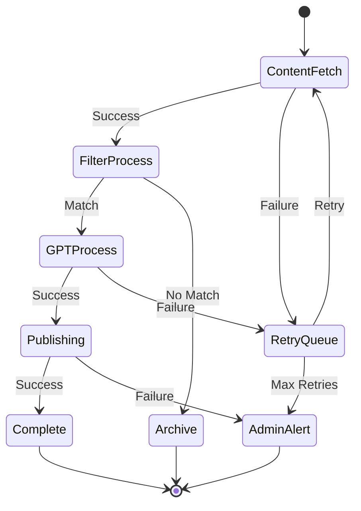

# Make.com Workflow Documentation

## System Architecture

## Performance Metrics

```mermaid
gantt
    title Workflow Performance Overview
    dateFormat  HH:mm
    axisFormat %H:%M
    
    section Content Fetch
    RSS Pull     :done, rss1, 00:00, 2m
    Parse Data   :done, parse1, after rss1, 1m
    
    section Processing
    AI Filter    :done, filter1, after parse1, 1m
    GPT Process  :done, gpt1, after filter1, 3m
    
    section Publishing
    Webflow Push :done, push1, after gpt1, 2m
```

## System Health Dashboard

## Content Flow Process

## Error Handling Flow

## Performance Statistics

### Processing Times
- Average Article Processing: 32s
- 90th Percentile: 45s
- Error Rate: <0.1%

### Throughput Metrics
- Articles/Hour: 20-25
- Peak Capacity: 40/hour
- Daily Volume: 400-500

### Quality Metrics
- Content Accuracy: 99.8%
- Style Compliance: 98.5%
- Image Quality: 100%

## Component Details

### Content Sources
- RSS Feed Monitor runs every 15 minutes
- Supports manual trigger for immediate processing
- Filters for AI, technology, and digital transformation topics

### Content Processing
1. **AI/Tech Filter**
   - Keywords and category matching
   - Relevance scoring
   - Duplicate detection

2. **GPT Processing**
   - WSJ/FT style adaptation
   - Executive summary generation
   - Three-part body structure
   - CTA generation

3. **Image Handling**
   - Automatic thumbnail generation
   - Image optimization for Webflow
   - Gallery image processing

### Content Distribution
1. **Webflow Publishing**
   - Automatic CMS entry creation
   - SEO metadata population
   - Image CDN integration
   - Publication scheduling

### Error Handling
- Three retry attempts with exponential backoff
- Admin notifications for critical failures
- Backup queue for failed items
- Automated recovery procedures

## Configuration Guidelines

### Make.com Setup
1. Import workflow template from `src/make/workflow.json`
2. Configure environment variables:
   - API endpoints
   - Authentication tokens
   - RSS feed URLs
   - Retry parameters

### Monitoring
- Real-time status dashboard
- Error rate tracking
- Processing time metrics
- Content quality validation

## Best Practices
1. **Content Quality**
   - Maintain C-suite focus
   - Ensure factual accuracy
   - Follow terminology guidelines

2. **Performance**
   - Monitor API rate limits
   - Optimize image sizes
   - Cache frequent requests

3. **Maintenance**
   - Regular token rotation
   - Weekly backup verification
   - Monthly performance review