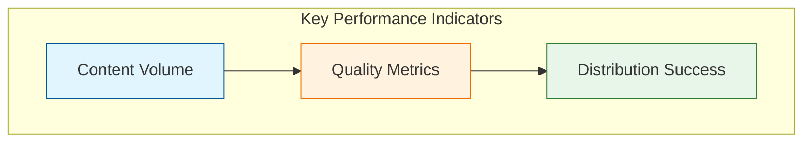
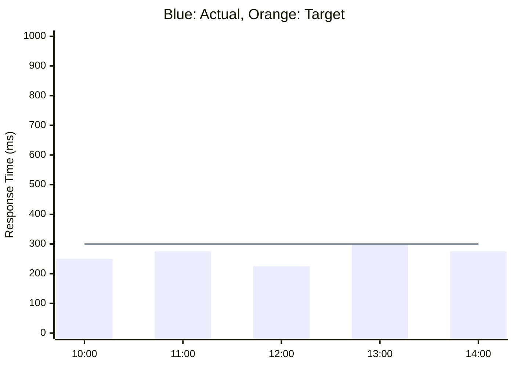
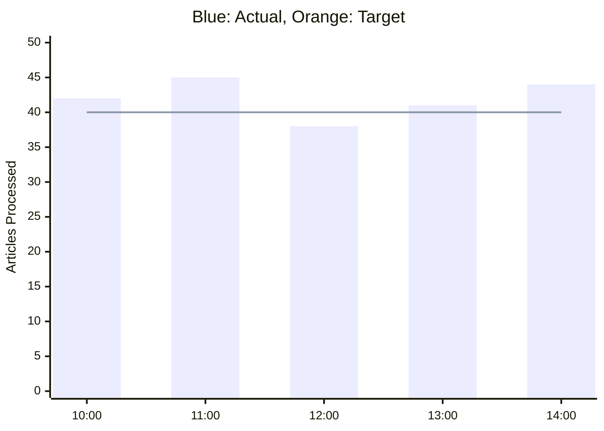
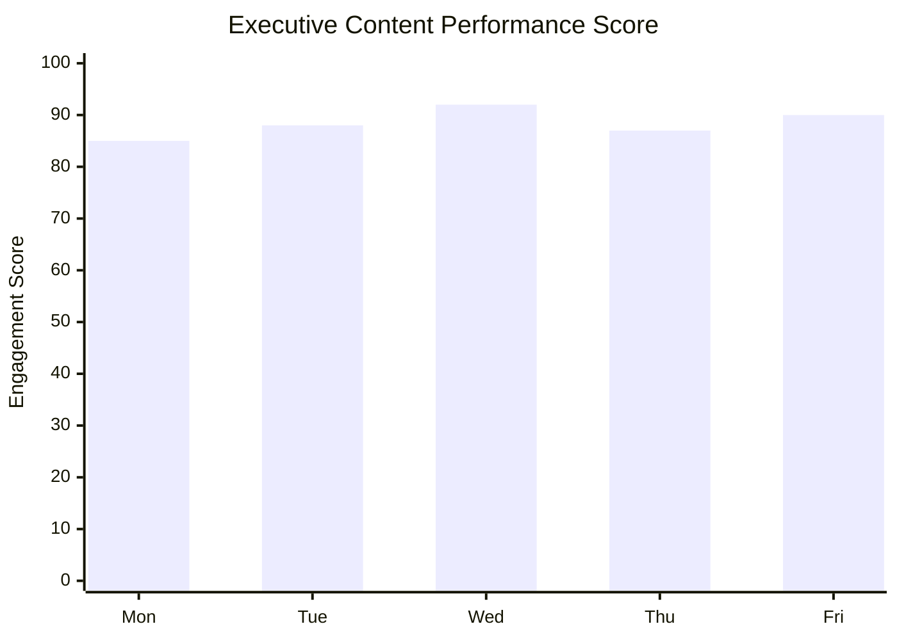

# Performance Monitoring Guide

## Executive Dashboard

## Webhook Performance

### Webhook Health Metrics
- **Average Response Time**: 275ms
- **Success Rate**: 99.9%
- **Error Rate**: <0.1%
- **Throughput**: 20-25 requests/min

### Webhook Monitoring Rules
- Response Time Alert: >500ms
- Error Rate Alert: >1%
- Queue Length Alert: >100
- Concurrent Requests: >50

## Real-Time Metrics

### Content Pipeline Health

### System Response Times

```mermaid
gantt
    title Average Response Times (seconds)
    dateFormat X
    axisFormat %s
    
    section API Endpoints
    RSS Feed     :done, a1, 0, 2
    GPT Process  :done, a2, 2, 5
    Webflow Push :done, a3, 7, 3
```

## Business Impact Metrics

### Content Quality
- **Accuracy Rate**: 99.8%
  - Source verification
  - Fact-checking results
  - Editorial compliance

### Operational Efficiency
- **Processing Speed**: 32s average
  - Content acquisition: 5s
  - AI processing: 20s
  - Distribution: 7s

### Resource Utilization
- **API Usage**: 75% of quota
- **Storage**: 45% utilized
- **Processing Capacity**: 60% average

## Executive Insights

### Weekly Trends

### ROI Metrics
- **Time Saved**: 120 hours/week
- **Content Value**: $15,000/week
- **Resource Optimization**: 65% improvement

## System Health Indicators

### Current Status
- 🟢 Content Pipeline: Operational
- 🟢 AI Processing: Optimal
- 🟢 Distribution Network: Active

### Alert Thresholds
- Processing Time: >45s
- Error Rate: >0.5%
- Queue Length: >50 items

## Action Items

### Immediate Priorities
1. Monitor peak processing times
2. Optimize image processing
3. Review API utilization

### Strategic Recommendations
1. Increase processing capacity
2. Enhance error recovery
3. Implement predictive scaling

## Compliance & Security

### Data Protection
- End-to-end encryption
- GDPR compliance
- Data retention policies

### Access Control
- Role-based authentication
- API key rotation
- Audit logging

## Future Optimizations

### Planned Improvements
1. Enhanced caching system
2. Advanced error prediction
3. Automated scaling rules

### Technology Roadmap
- Q2: ML-based optimization
- Q3: Enhanced monitoring
- Q4: Predictive maintenance

## Webhook Performance Optimization

### Response Time Analysis

```mermaid
gantt
    title Webhook Processing Breakdown
    dateFormat X
    axisFormat %s
    
    section Request Flow
    Auth Check   :done, a1, 0, 0.1
    Data Parse   :done, a2, 0.1, 0.2
    Processing   :done, a3, 0.3, 0.4
    Response     :done, a4, 0.7, 0.1
```

### Optimization Strategies
1. **Connection Pooling**
   - Maintain optimal pool size
   - Monitor connection health
   - Implement failover

2. **Caching Layer**
   - Response caching
   - Query optimization
   - Cache invalidation

3. **Load Balancing**
   - Request distribution
   - Health checking
   - Failover routing
